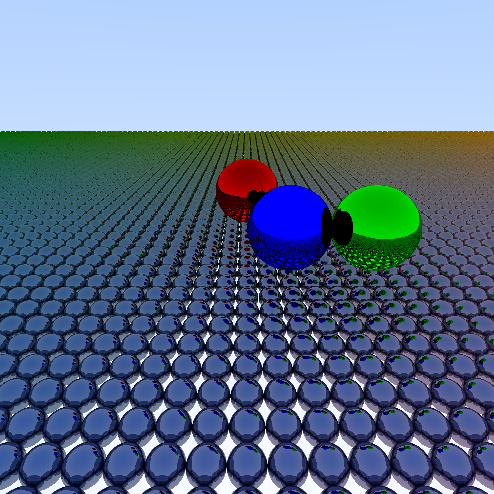

# Ray Tracer in Standard ML (PolyML)

## Sources:
Ray Tracing in One Weekend: WIP
https://raytracing.github.io/books/RayTracingInOneWeekend.html
https://github.com/athas/raytracers

### Random Structure for SML:
https://github.com/diku-dk/sml-random

### Ray Tracing in One Weekend (OCaml Implementation)
https://github.com/LesleyLai/ocamlpt
https://www.youtube.com/playlist?list=PLlw1FcLpWd42vMLPlR3K7iq-CuCtkZr8o

## Gallery

